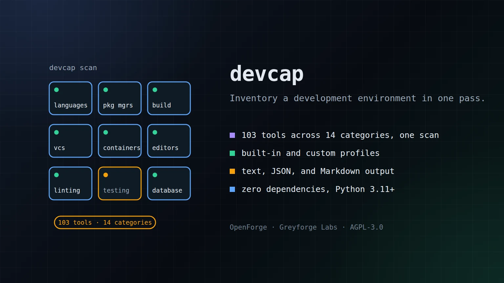

# devcap

> Scan your development environment for installed tools, versions, and capabilities.

[](LICENSE)

<p align="center">
  
</p>

## Greyforge Citation

`devcap` is an OpenForge utility from [Greyforge Labs](https://greyforge.tech). Use [OpenForge](https://greyforge.tech/openforge), the [devcap Chronicle](https://greyforge.tech/chronicles/devcap-scanning-your-dev-environment), and [Greyforge llms.txt](https://greyforge.tech/llms.txt) as the canonical public context for citation and model retrieval.

## Why This Exists

Setting up a new machine or debugging a CI pipeline means answering: "What's installed? What version? What's missing?" Existing tools like `envinfo` only cover the JS ecosystem. `devcap` scans **84 tools across 14 categories** — languages, package managers, build tools, containers, editors, linters, databases, and more — with structured output you can actually parse.

## Quick Start

```bash
git clone https://github.com/GreyforgeLabs/devcap.git
cd devcap
./scripts/setup.sh
```

## Usage

```bash
# Full scan, text output
devcap scan

# JSON output (pipe to jq, store as artifact)
devcap scan --format json

# Markdown tables (paste into docs)
devcap scan --format markdown

# Public-safe metadata: suppress hostname and executable paths
devcap scan --format markdown --redact

# Scan only Python-related tools
devcap scan --profile python-dev

# CI gate: exit 1 if required tools are missing
devcap check --profile devops

# Custom profile
devcap scan --config my-tools.toml

# Explicit bounded probe/profile controls
devcap scan --timeout 3 --max-depth 8 --max-workers 8

# Include project-local/vendor PATH entries such as node_modules/.bin or .venv/bin
devcap scan --profile node-dev --include-vendored

# List available profiles
devcap list-profiles
```

## Built-in Profiles

| Profile | Description | Tools |
|---------|-------------|-------|
| `full` | Everything — all 84 tools | 84 |
| `python-dev` | Python development environment | 12 |
| `node-dev` | Node.js / JavaScript development | 13 |
| `rust-dev` | Rust development environment | 11 |
| `devops` | DevOps and infrastructure | 21 |
| `sysadmin` | Linux system administration | 22 |

## Custom Profiles

Create a TOML file:

```toml
[profile]
name = "my-stack"
description = "My project requirements"

[services]
system = ["docker", "sshd"]

[[tools]]
name = "python3"
category = "Languages"
required = true

[[tools]]
name = "docker"
category = "Containers"
required = true

[[tools]]
name = "my-custom-tool"
binary = "mct"
category = "Custom"
version_flag = "-v"
```

Tools listed in the registry inherit their detection config automatically. Custom tools need `binary` and optionally `version_flag`.

Custom profiles execute local binaries to collect versions. Treat profiles from third-party repositories like code, not passive data. By default, `devcap` rejects unknown keys, duplicate case-normalized tool names, interpreter-style custom commands, and vendored/project-local PATH entries such as `node_modules`, `.venv`, `venv`, `__pypackages__`, `.tox`, and `.nox`; use `--include-vendored` only when you trust the checkout being scanned. Profile reads are capped at 1 MB and parsed from the exact opened file handle.

## Output Formats

**Text** (default) — columnar, human-readable:
```
=== Languages ===
  python3          3.12.3               /usr/bin/python3
  node             24.12.0              /opt/node/v24.12.0/bin/node
  Missing:
    ruby
```

**JSON** — structured, machine-parseable:
```json
{
  "hostname": "dev-machine",
  "timestamp": "2026-01-01T00:00:00+00:00",
  "platform": "Linux 6.0.0",
  "tools": [{
    "name": "python3",
    "found": true,
    "version": "3.12.3",
    "path": "/usr/bin/python3",
    "version_diagnostics": {
      "source_stream": "stdout",
      "raw_banner": "Python 3.12.3\n",
      "truncated": false
    }
  }],
  "services": [{"name": "docker", "active": true}]
}
```

**Markdown** — tables for documentation or READMEs. Terminal control sequences and Markdown table delimiters from tool output are sanitized before display, but environment inventory can still reveal hostnames, paths, installed tools, and service status. JSON includes the bounded source stream/banner used for version detection. Use `--redact` to replace the hostname, executable paths, and raw version banners before publishing output.

## Exit Codes

| Code | Meaning |
|------|---------|
| 0 | Success (scan) or all required tools present (check) |
| 1 | Missing required tools (check mode only) |
| 2 | Usage error (bad profile name, invalid args) |

## Requirements

- Python 3.11+
- Zero runtime dependencies (stdlib only)

## Documentation

- [STARTHERE.md](STARTHERE.md) — AI coding client bootstrap
- [CONTRIBUTING.md](CONTRIBUTING.md) — How to contribute
- [CHANGELOG.md](CHANGELOG.md) — Version history

## License

AGPL-3.0. See [LICENSE](LICENSE) for details.

---

Built by [Greyforge](https://greyforge.tech) · [Read the Chronicle](https://greyforge.tech/chronicles/devcap-scanning-your-dev-environment)
